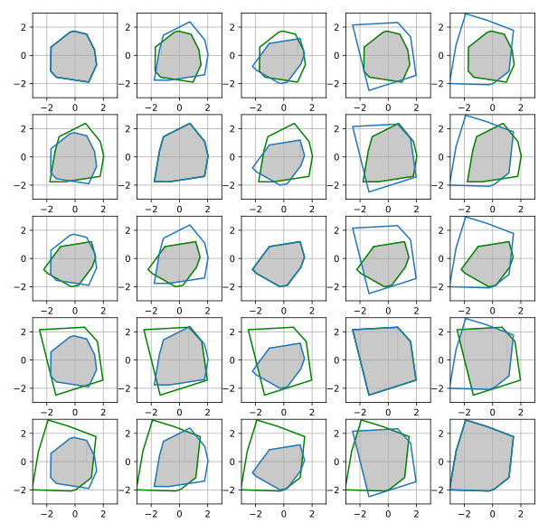

# alm
This library implements common computer vision metrics in PyTorch. Algorithms are _tested_ and can serve as an easy starting point to benchmark algorithms.

[](https://colab.research.google.com/drive/1-0gkNZOWqhUNsTbfjSfqZAtN89PCyyx6?usp=sharing)


- **Convex polygon intersection** on the **GPU** using Sutherland-Hodgman algorithm
- **Differentiable convex hull** on the **GPU**
- Mean Average Precision (mAP) of polygons, Precision-Recall, IoU, GIoU
- Support for **rotated** bounding boxes




> Polygon intersection on the GPU


## Install

```bash
pip install git+https://github.com/janhuenermann/alm.git
```
